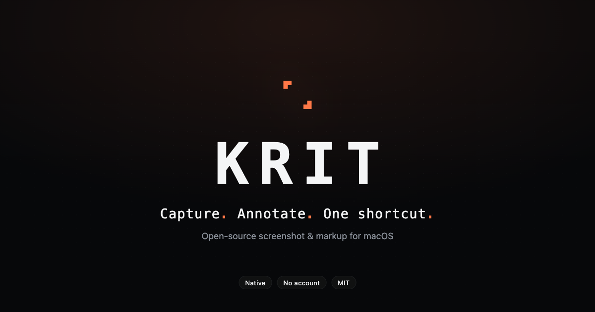
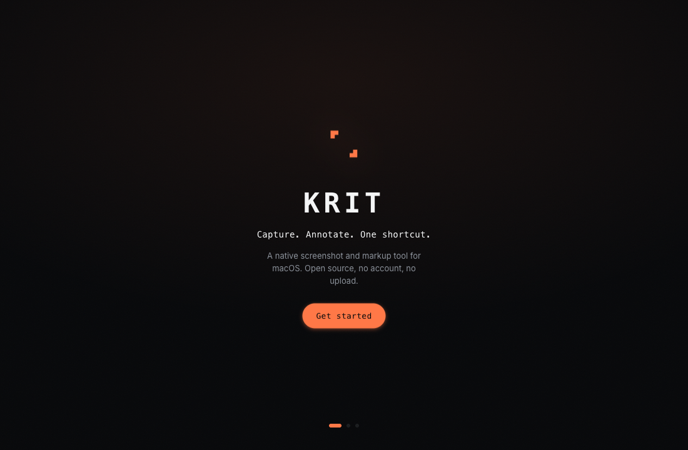
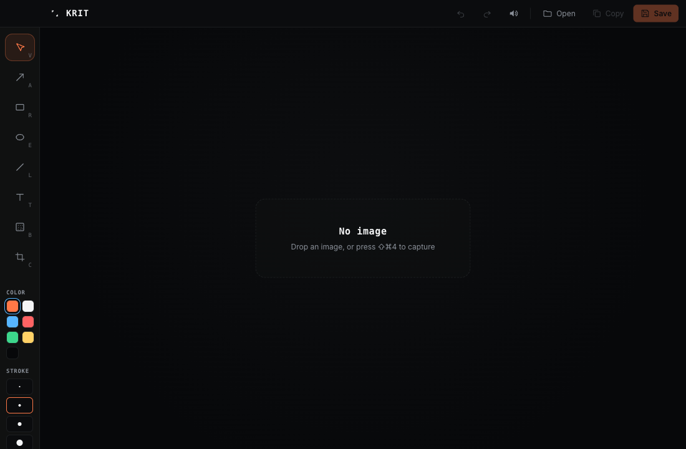

<div align="center">



<br />

[](LICENSE)


A native screenshot and markup tool for macOS. Open source, no account, no upload.

</div>

---

KRIT takes a shot, drops you into an editor, and gets out of the way. Press a
shortcut, drag a region, mark it up, copy it. The capture path is native Swift;
the editor is a Tauri + React app. Nothing you capture leaves your machine.

It's free and MIT-licensed. Screen recording is on the roadmap, not in this
release — see [Status](#status).

<div align="center">


</div>

## What it does

- **Snap** — region or full screen from a global shortcut. The screen freezes
  the instant you trigger, so a hover state or open menu stays put while you select.
- **Markup** — arrow, rectangle, ellipse, line, text, blur, crop. Eight tools,
  keyboard-driven, with undo/redo.
- **Copy / Save** — full-resolution PNG to the clipboard or disk. No re-encode,
  no quality loss.
- **Menu bar** — KRIT lives in the menu bar, not the Dock. One icon, one menu.
- **Quiet by default** — a few UI sounds you can mute, and one accent color. It
  doesn't nag you with badges or upsells.

## Install

KRIT is distributed unsigned (no paid Apple Developer account yet), so macOS
will quarantine it on first open. Two steps:

1. Download `KRIT_0.1.0_aarch64.dmg` from the
   [latest release](https://github.com/leonardocandiani/krit/releases/latest)
   and drag KRIT to Applications.
2. Clear the quarantine flag so Gatekeeper lets it run:

   ```sh
   xattr -dr com.apple.quarantine /Applications/KRIT.app
   ```

On first launch, KRIT asks for **Screen Recording** permission — macOS requires
it for any app that reads the screen. Grant it in System Settings › Privacy &
Security › Screen Recording, then reopen KRIT.

## Build from source

You need Xcode 15+, Rust, and [Bun](https://bun.sh).

```sh
git clone https://github.com/leonardocandiani/krit.git
cd krit

# 1. design tokens -> CSS
cd packages/tokens && bun install && bun run build && cd -

# 2. native capture helper (Swift)
cd apps/helper
swift build -c release --build-path /tmp/krit-build
./scripts/make-app.sh /tmp/krit-build release
cd -

# 3. the app (bundles the helper, outputs a .dmg)
cd apps/shell
bun install
bun run tauri build
```

The `.dmg` and `.app` land in `apps/shell/src-tauri/target/release/bundle/`.

## Shortcuts

| Shortcut | Action |
| --- | --- |
| <kbd>⇧</kbd><kbd>⌘</kbd><kbd>4</kbd> | Snap a region |
| <kbd>⇧</kbd><kbd>⌘</kbd><kbd>3</kbd> | Snap the full screen |
| <kbd>⌘</kbd><kbd>C</kbd> | Copy to clipboard |
| <kbd>⌘</kbd><kbd>S</kbd> | Save as PNG |
| <kbd>⌘</kbd><kbd>Z</kbd> / <kbd>⇧</kbd><kbd>⌘</kbd><kbd>Z</kbd> | Undo / redo |
| <kbd>V A R E L T B C</kbd> | Select tool by letter |

## How it works

KRIT is split along the line that matters for performance: pixels stay native,
everything else is TypeScript.

- **`apps/helper`** — a Swift agent (`LSUIElement`) that owns the hot path:
  global hotkeys, the freeze-frame snapshot, the AppKit selection overlay, and
  the crop. It captures via ScreenCaptureKit and writes a PNG. Captured frames
  never cross the IPC boundary — only the file path does.
- **`apps/shell`** — a Tauri 2 + React app holding the Konva annotation editor,
  the menu-bar tray, and export. It launches the helper one-shot and opens the
  result.
- **`packages/tokens`** — one JSON design source compiled by Style Dictionary
  into CSS variables (web) and Swift (native), so both halves share one palette.

## Status

This is **v0.1** — still capture and annotation, built in the open.

| | KRIT v0.1 | CleanShot X | Cap |
| --- | :---: | :---: | :---: |
| Region & screen capture | ✅ | ✅ | ✅ |
| Annotation editor | ✅ | ✅ | — |
| Copy / save full-res | ✅ | ✅ | ✅ |
| Screen recording | roadmap | ✅ | ✅ |
| OCR / grab text | roadmap | ✅ | — |
| Scrolling capture | roadmap | ✅ | — |
| Cloud upload | not planned | ✅ | ✅ |
| Price | free | paid | freemium |
| Open source | ✅ | — | ✅ |

KRIT reimplements features from scratch. It shares no code, assets, or branding
with CleanShot X or Cap. The table is a comparison, not a lineage.

## Automation (CLI for agents and scripts)

KRIT ships a command line tool at `KRIT.app/Contents/Helpers/krit`. It talks to
the running app, so captures reuse KRIT's Screen Recording permission, and
annotation runs headless. Output is a single JSON line per command, which makes
it directly usable from agents like Claude Code:

```bash
KRIT=/Applications/KRIT.app/Contents/Helpers/krit

# Capture a region (top-left origin, points) or the full screen
$KRIT capture --region 300,200,800,500 --out shot.png
$KRIT capture --fullscreen --out screen.png

# Draw on an existing image (pixel coordinates, top-left origin)
$KRIT annotate --in shot.png --out annotated.png --spec '[
  {"type":"arrow","from":[200,800],"to":[700,400],"color":"#ff3b6b","width":8},
  {"type":"box","rect":[450,120,300,160],"color":"#ff9500","width":5},
  {"type":"text","at":[460,320],"text":"Look here","size":34,"color":"#ffffff"},
  {"type":"step","at":[80,100],"number":1},
  {"type":"blur","rect":[900,600,300,200]}
]'
```

Spec types: `arrow`, `box`, `ellipse`, `line`, `text`, `step`, `highlight`,
`blur`, `pixelate`. Errors come back as `{"ok":false,"error":...,"code":...}`
with a non-zero exit code.

## Roadmap

- **v0.1** — region/screen capture + annotation editor *(now)*
- **v0.2** — full annotation set, OCR (grab text), capture history
- **v0.3** — screen recording (video + audio)
- **v0.4** — scrolling capture
- **v1.0** — Homebrew, polish, signed builds

## Contributing

Issues and PRs welcome. See [CONTRIBUTING.md](CONTRIBUTING.md) for the layout,
build steps, and the one rule that matters: original code and assets only.

## License

[MIT](LICENSE) © Leonardo Candiani
