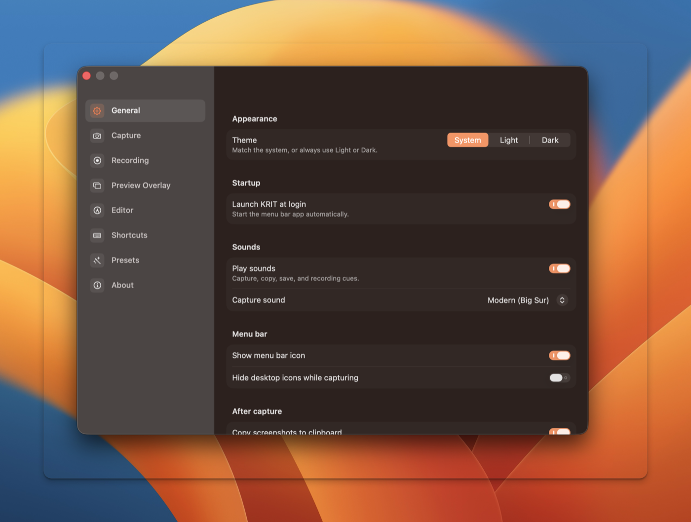

<div align="center">

<h1>KRIT</h1>

<p><strong>Native macOS screenshot studio. Capture, annotate, record, all from the menu bar.</strong></p>

<p>
  Built with
  <a href="https://developer.apple.com/documentation/appkit">AppKit</a>,
  <a href="https://developer.apple.com/xcode/swiftui/">SwiftUI</a>,
  <a href="https://developer.apple.com/documentation/screencapturekit">ScreenCaptureKit</a>, and
  <a href="https://developer.apple.com/documentation/vision">Vision</a>.
</p>

<p>
  <a href="#features">Features</a> •
  <a href="#install">Install</a> •
  <a href="#shortcuts">Shortcuts</a> •
  <a href="#automation">Automation</a> •
  <a href="#build-from-source">Build</a> •
  <a href="#permissions">Permissions</a> •
  <a href="#acknowledgments">Acknowledgments</a> •
  <a href="#license">License</a>
</p>

<p>
  <a href="LICENSE"></a>
  
  <a href="https://github.com/leonardocandiani/krit/releases"></a>
</p>

<br />



</div>

KRIT takes a shot, drops you into an editor, and stays out of the way. It runs
from the menu bar, has no account and no cloud, and nothing you capture leaves
your Mac. The capture path is native Swift on ScreenCaptureKit, the editor is
AppKit, and the whole app ships as a single bundle with a command line tool and
an MCP server for AI agents.

## Features

- **Screenshot**: area, window (isolated through ScreenCaptureKit and composed over the real wallpaper with a shadow), and fullscreen capture. Capture quality is configurable (Standard, High 2x, Maximum 3x supersampling), with an optional countdown before the shot.
- **All-in-One**: one shortcut opens a radial panel to pick any capture or recording mode on the spot.
- **Scrolling capture**: stitch a long page or list into a single tall image.
- **Snap & Paste**: capture and drop the result straight into the app you were using.
- **Read the screen**: pull text out of any capture with OCR, or decode a QR code in frame.
- **Annotation editor**: a two-band toolbar (CleanShot style) with a contextual properties bar per tool. Arrows, rectangles, ellipses, lines, freehand, rich text with style presets and backplates, numbered steps, and a highlighter that snaps onto detected text lines.
- **Redaction**: blur and pixelate, an irreversible Secure Blur that bakes a mosaic under the gaussian pass, and Smart Redact that finds emails, keys, and card numbers and proposes the boxes for you.
- **Editing**: crop with contextual Cancel/Apply, full zoom and pan (Cmd+scroll, pinch, Space+drag, Cmd+0), undo/redo, duplicate, and arrow-key nudge.
- **Backgrounds**: drop a capture onto gradient, wallpaper, or solid backgrounds with padding, inset, corner radius, shadow, and aspect ratio controls, plus reusable presets.
- **Color picker**: a saturation/brightness field with a draggable favorites strip you can reorder and prune.
- **Screen recording**: record the screen, a window, or an area to MP4 or GIF, with system audio and microphone, a floating camera bubble, mouse click highlights, and a keystroke overlay. Trim and convert the clip after you stop.
- **Quick Access**: a floating card after every capture. Drag it out to drop the file into an app, drag it down to stash it, or fling it off the anchor line to delete.
- **Preview and pin**: hit Space to Quick Look a shot, or pin it to the desktop so it floats on top while you work.
- **History**: a floating panel and full browser of recent screenshots, videos, and GIFs, with type and time filters, badges, and restore back into the editor.
- **Native feel**: lives in the menu bar (no Dock icon), Liquid Glass surfaces on macOS 26 and later with a blur fallback below, and light, dark, or system appearance.

## Install

> Requires **macOS 13.0** (Ventura) or later.

### Homebrew

```bash
brew tap leonardocandiani/krit https://github.com/leonardocandiani/krit
brew install --cask krit
```

### Shell script

```bash
curl -fsSL https://raw.githubusercontent.com/leonardocandiani/krit/main/install.sh | bash
```

### Download a release

1. Go to [Releases](https://github.com/leonardocandiani/krit/releases) and download `KRIT-v<version>-macOS.dmg`.
2. Open the DMG and drag **KRIT** to Applications.
3. Clear the quarantine flag so Gatekeeper lets it run:

   ```bash
   xattr -dr com.apple.quarantine /Applications/KRIT.app
   ```

KRIT is not notarized yet (no paid Apple Developer account), so macOS quarantines
it on first open. The `xattr` step above removes that flag. Without it, macOS
shows an "unidentified developer" warning and refuses to launch.

## Shortcuts

Every global shortcut is rebindable in Preferences. These are the defaults.

| Action | Shortcut |
| --- | --- |
| Area screenshot | <kbd>⇧⌘4</kbd> |
| Window screenshot | <kbd>⇧⌘5</kbd> |
| Fullscreen screenshot | <kbd>⇧⌘3</kbd> |
| Capture previous area | <kbd>⇧⌘7</kbd> |
| All-in-One | <kbd>⇧⌘A</kbd> |
| Snap & Paste | <kbd>⇧⌘P</kbd> |
| Screen recording | <kbd>⇧⌘6</kbd> |
| OCR (capture text) | <kbd>⇧⌘O</kbd> |
| Scrolling capture | <kbd>⇧⌘S</kbd> |
| Capture history | <kbd>⇧⌘H</kbd> |

In the editor, tools are one key each: <kbd>V</kbd> select, <kbd>A</kbd> arrow,
<kbd>R</kbd> rectangle, <kbd>E</kbd> ellipse, <kbd>L</kbd> line, <kbd>D</kbd>
freehand, <kbd>T</kbd> text, <kbd>N</kbd> numbered steps, <kbd>H</kbd>
highlighter, <kbd>B</kbd> blur, <kbd>P</kbd> pixelate, <kbd>C</kbd> crop.

## Automation

KRIT ships a command line tool and an MCP server inside the bundle, so agents
and scripts can capture and read the screen without leaving the app. Both talk
to the running app, so captures reuse KRIT's Screen Recording permission and
annotation runs headless.

### CLI

The binary lives at `KRIT.app/Contents/Helpers/krit`.

```bash
KRIT=/Applications/KRIT.app/Contents/Helpers/krit

# Capture a region (global top-left origin, points) or the full screen
$KRIT capture --region 300,200,800,500 --out shot.png
$KRIT capture --fullscreen --out screen.png

# Draw on an existing image (pixel coordinates, top-left origin)
$KRIT annotate --in shot.png --out annotated.png --spec '[
  {"type":"arrow","from":[200,800],"to":[700,400],"color":"#ff3b6b","width":8},
  {"type":"box","rect":[450,120,300,160],"color":"#ff9500","width":5},
  {"type":"text","at":[460,320],"text":"Look here","size":34,"color":"#ffffff"},
  {"type":"step","at":[80,100],"number":1},
  {"type":"blur","rect":[900,600,300,200]}
]'

# Read the accessibility tree of the frontmost window
$KRIT inspect
```

Each command prints a single JSON line. Errors come back as
`{"ok":false,"error":...,"code":...}` with a non-zero exit code.

### MCP server

`krit mcp` runs a JSON-RPC MCP server over stdin/stdout, so an agent like Claude
Code can capture and read the screen in one call. Tools: `capture_region`,
`capture_fullscreen`, `annotate_image`, `capture_and_read` (captures, then OCRs
the result locally with Vision), and `inspect_ui`.

## Build from source

You need Xcode 15 or later (Swift 5.9+) on macOS 13 or later.

```bash
git clone https://github.com/leonardocandiani/krit.git
cd krit/app

# Build the app and the krit CLI, assemble and sign the bundle, copy to /Applications
./build-app.sh
```

To build the targets by hand:

```bash
cd app
swift build -c release --product KritApp   # the menu-bar app
swift build -c release --product krit       # the CLI / MCP binary
```

`build-app.sh` builds both targets into separate paths (the `krit` CLI and the
`KritApp` binary would otherwise collide on a case-insensitive volume),
assembles the `.app`, ad-hoc signs it, and installs it. To package a DMG, run
`./make-dmg.sh` afterward.

## Permissions

- **Screen Recording** (required): macOS gates every screen read behind it. KRIT asks on first launch. Grant it in System Settings › Privacy & Security › Screen Recording, then reopen KRIT.
- **Accessibility** (optional): needed for Snap & Paste (it synthesizes the paste keystroke) and for the click and keystroke overlay during recording.
- **Microphone / Camera** (optional): only when you enable microphone audio or the camera bubble for a recording.

KRIT runs without the App Sandbox, sends no telemetry, and makes no network
requests of its own. Everything stays on disk in `~/Pictures/KRIT`.

## Acknowledgments

KRIT is inspired by [CleanShot X](https://cleanshot.com/) and reimplements its
ideas from scratch in native Swift. The editor's two-band toolbar and several
interaction patterns were studied against [Snapzy](https://github.com/duongductrong/Snapzy),
an open source (BSD-3) take on the same space. KRIT also draws on
[Shotnix](https://github.com/OMARVII/Shotnix) (MIT). Third-party dependencies
are listed in [THIRD_PARTY_NOTICES.md](app/THIRD_PARTY_NOTICES.md).

## License

[MIT](LICENSE) © Leonardo Candiani
